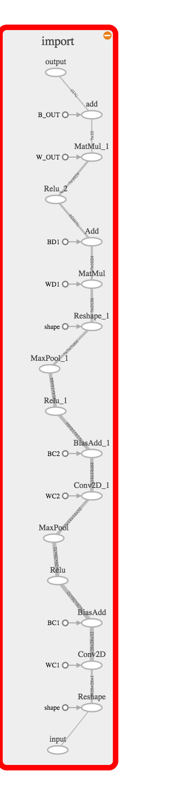

# Custom Tensor Flow Android App

### view_pb_graph.py

This file contains a script to create a .local file that can be viewed on tensorboard. Be sure to edit the path directories for the .pb file and the output file. 

The optimised graph should look like:

### mnist.py

After running mnist.py the .pb graph must be optimised for inference. This can be done by opening terminal to the .pb file directory and enetering the command:

'''
python -m tensorflow.python.tools.optimize_for_inference --input mnist_model_graph.pb --output mnist_optimized_graph.pb --input_names='input' --output_names='output'
'''

