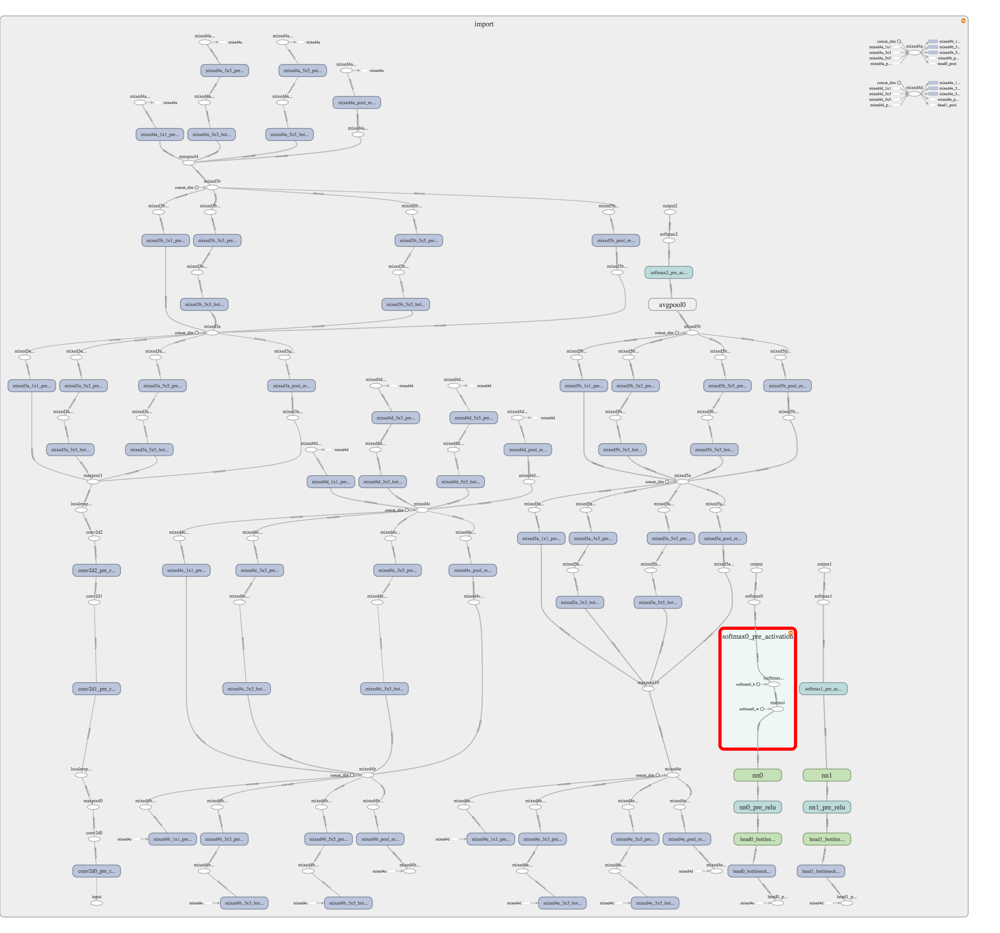

# MNIST Tensor Flow example Model + Optimised Graph

The above code is used to generate an MNIST Model which could potentially incorporated into an application. There is also a python script which creates the necessary .local file to view the TF graph in TensorBoard.

### view_pb_graph.py

This file contains a script to create a .local file that can be viewed on tensorboard. Be sure to edit the path directories for the .pb file and the output file. 

The optimised graph should look like:

The original graph in the android tensorflow stock app looks like:

### mnist.py

After running mnist.py the .pb graph must be optimised for inference. This can be done by opening terminal to the .pb file directory and enetering the command:

'''
python -m tensorflow.python.tools.optimize_for_inference --input mnist_model_graph.pb --output mnist_optimized_graph.pb --input_names='input' --output_names='output'
'''

